# 💼 Subscription Manager

<div align="center">


**A modern, secure subscription tracking platform with stunning UI and enterprise-grade features**

[Features](#-features) • [Demo](#-screenshots--demo) • [Installation](#-quick-start) • [Documentation](#-documentation) • [Contributing](#-contributing)

</div>

---

## 🎯 Overview

Subscription Manager is a full-stack MERN application that helps you track, manage, and optimize your recurring subscriptions. Built with modern technologies and security best practices, it features a beautiful glassmorphism UI with interactive WebGL backgrounds.

### 🌟 Why Subscription Manager?

- 💰 **Save Money** - Track all subscriptions in one place, identify unused services
- 🔐 **Bank-Grade Security** - JWT authentication, OTP verification, encrypted passwords
- 🎨 **Beautiful Design** - LiquidEther WebGL effects, glassmorphism, smooth animations
- 📱 **Fully Responsive** - Seamless experience across desktop, tablet, and mobile
- 🚀 **Lightning Fast** - Built with Vite, optimized performance, instant updates

---

## 📸 Screenshots & Demo

### 🏠 Landing Page
<div align="center">

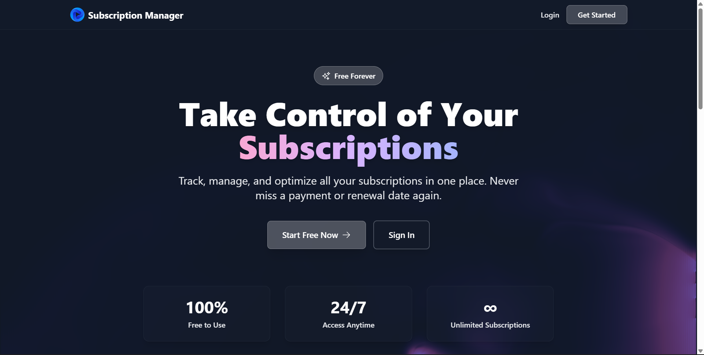
*Interactive LiquidEther WebGL background with fluid mouse tracking*

</div>

### 🔐 Authentication

<table>
<tr>
<td width="50%">

#### Login
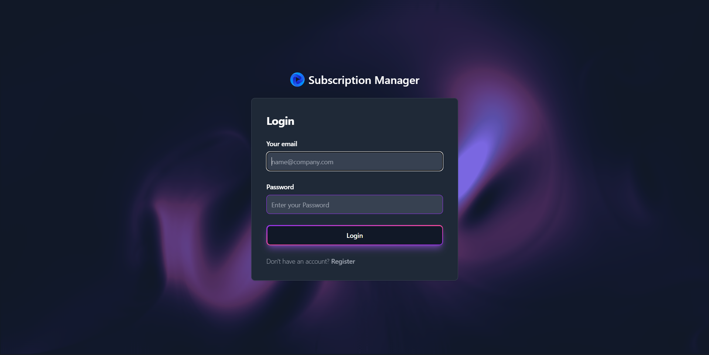
*Secure JWT-based authentication*

</td>
<td width="50%">

#### Sign Up
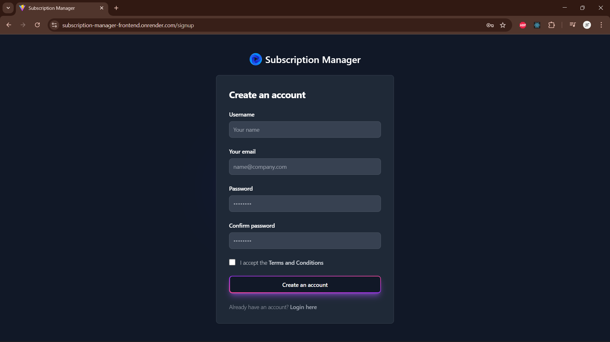
*Quick registration with email verification*

</td>
</tr>
</table>

### 📊 Dashboard & Management

<div align="center">

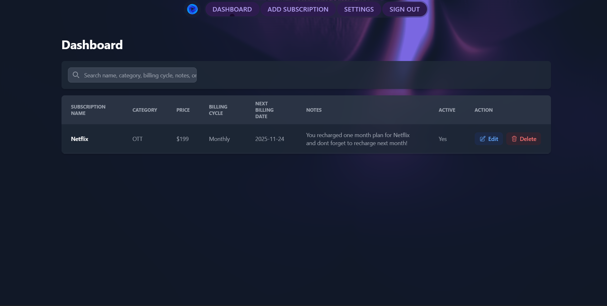
*Main dashboard with all subscriptions, search, and quick actions*

</div>

### ➕ Add Subscription

<div align="center">

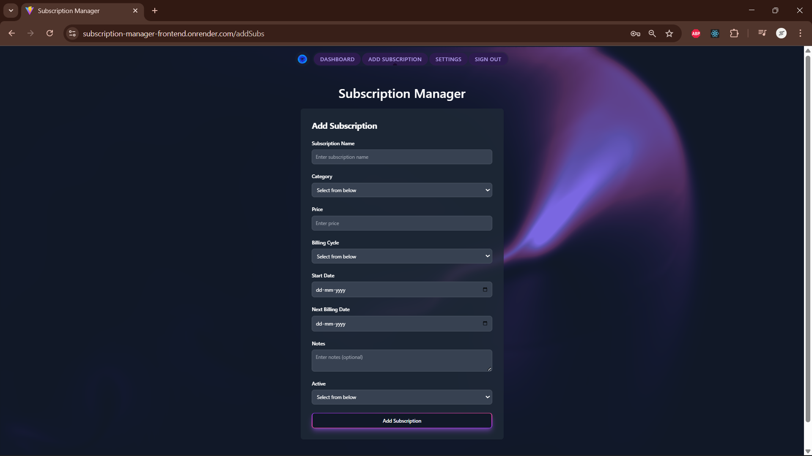
*Intuitive form with category selection and billing cycle tracking*

</div>

### ⚙️ Settings & Account Management

<div align="center">

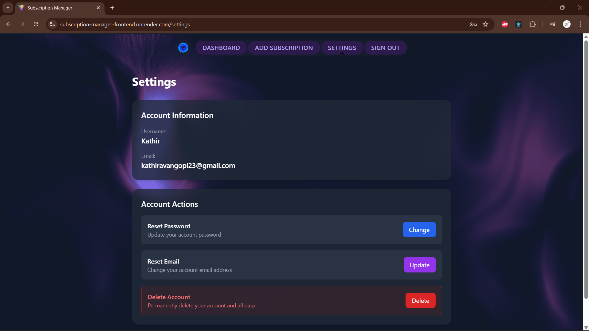
*Comprehensive account settings with security options*

</div>

<table>
<tr>
<td width="33%">

#### 🔑 Password Reset
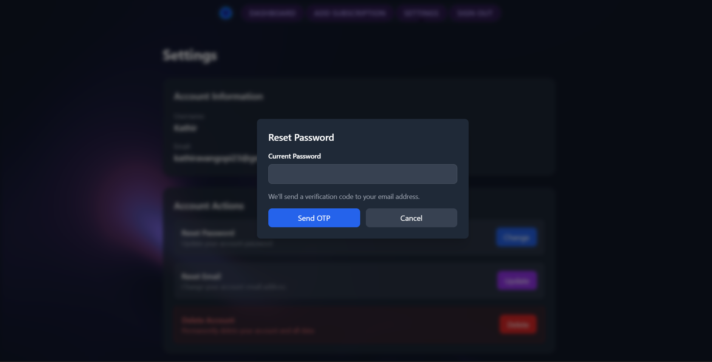
*OTP-verified password changes*

</td>
<td width="33%">

#### 📧 Email Update
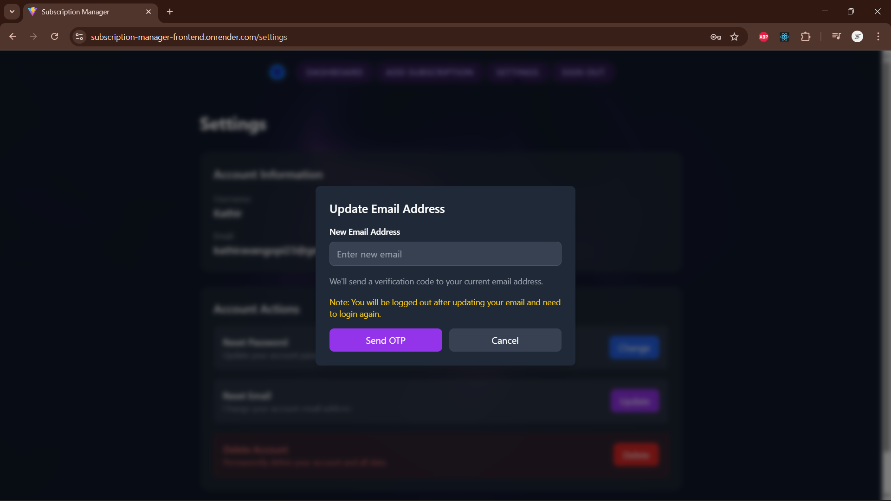
*Secure email update with verification*

</td>
<td width="33%">

#### 🗑️ Account Deletion
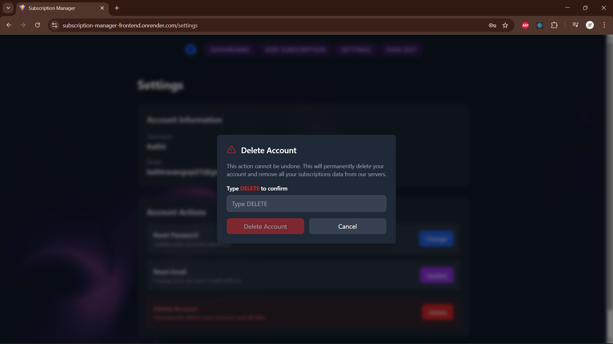
*Safe account deletion with confirmation*

</td>
</tr>
</table>

---

## ✨ Features

### 🎨 **Modern UI/UX**

<table>
<tr>
<td width="50%">

#### Visual Effects
- 🌊 **LiquidEther Background** - Interactive WebGL fluid simulation
- 💎 **Glassmorphism Cards** - Translucent design with backdrop blur
- ⚡ **ElectricBorder Components** - Animated SVG borders
- 🧭 **PillNav Navigation** - GSAP-powered smooth animations
- 🌓 **Dark/Light Themes** - Seamless theme switching
- 📱 **Responsive Design** - Mobile-first approach

</td>
<td width="50%">

#### User Experience
- ⚡ **Instant Feedback** - Real-time notifications
- 🎯 **Intuitive Navigation** - Clear information architecture
- 🔍 **Smart Search** - Filter by name or category
- ♿ **Accessible** - ARIA labels and keyboard navigation
- 🎭 **Smooth Transitions** - No jarring page loads
- 💫 **Micro-interactions** - Delightful hover effects

</td>
</tr>
</table>

### 🔐 **Enterprise Security**

| Feature | Description | Status |
|---------|-------------|--------|
| 🍪 **JWT Cookies** | HTTP-only secure cookies (7-day expiration) | ✅ Implemented |
| 🔢 **OTP Verification** | 6-digit codes for sensitive operations | ✅ Implemented |
| 🔑 **Password Hashing** | bcrypt with 10 salt rounds | ✅ Implemented |
| 📧 **Email Verification** | Nodemailer with HTML templates | ✅ Implemented |
| 🛡️ **Data Isolation** | User-specific data filtering | ✅ Implemented |
| 🔒 **Password Reset** | OTP-verified password recovery | ✅ Implemented |
| ✉️ **Email Update** | OTP-verified email changes | ✅ Implemented |

### 📊 **Subscription Management**

<details>
<summary><b>📝 Core Features (Click to expand)</b></summary>

- ✅ **Create Subscriptions** - Add with name, price, category, billing cycle
- 📖 **View All Subscriptions** - Dashboard with card grid layout
- ✏️ **Edit Subscriptions** - Update any field in-place
- 🗑️ **Delete Subscriptions** - Remove with confirmation
- 🔍 **Search & Filter** - Real-time search by name
- 🏷️ **Category Organization** - Entertainment, Productivity, Gaming, etc.
- 💰 **Price Tracking** - Monitor total monthly/yearly costs
- 📅 **Billing Cycle** - Weekly, Monthly, Yearly options
- 📆 **Next Billing Date** - Automatic calculation
- 🟢 **Status Toggle** - Mark active/inactive
- 📝 **Notes Field** - Add custom notes per subscription

</details>

### 👤 **Account Management**

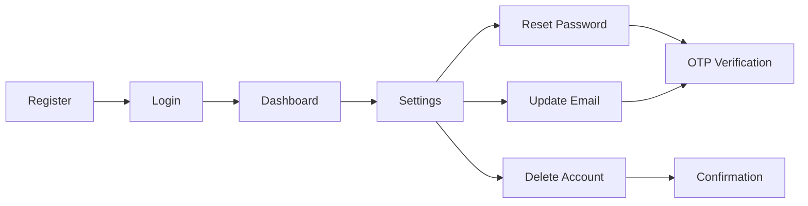

---

## 🛠️ Tech Stack

### Frontend Architecture

```
React 19 + Vite
├── State Management: Redux Toolkit + RTK Query
├── Routing: React Router v7
├── Styling: Tailwind CSS 3.4
├── Animation: GSAP + Framer Motion
├── 3D Graphics: Three.js (LiquidEther)
├── Forms: React Hook Form
├── Notifications: React Toastify
└── UI Components: Headless UI
```

### Backend Architecture

```
Node.js + Express
├── Database: MongoDB + Mongoose
├── Authentication: JWT + bcrypt
├── Email: Nodemailer (Gmail SMTP)
├── Validation: Express Validator
├── Security: Helmet, CORS
└── Environment: dotenv
```

### Development Tools

| Tool | Purpose | Version |
|------|---------|---------|
| ESLint | Code linting | Latest |
| Prettier | Code formatting | Latest |
| Nodemon | Auto-restart server | Latest |
| PostCSS | CSS processing | Latest |
| Vite | Build tool | 5.4.20 |

---

## 🚀 Quick Start

### Prerequisites

Before you begin, ensure you have:

- ✅ **Node.js** v16+ ([Download](https://nodejs.org/))
- ✅ **MongoDB** v5+ ([Download](https://www.mongodb.com/try/download/community))
- ✅ **Git** ([Download](https://git-scm.com/))
- ✅ **Gmail Account** (for email functionality)

### Installation Steps

#### 1️⃣ Clone Repository

```bash
git clone https://github.com/KathiravanGopi/Subscription-Manager.git
cd Subscription-Manager
```

#### 2️⃣ Backend Setup

```bash
cd backend
npm install
```

**Create `.env` file:**

```bash
cp .env.example .env
```

**Configure environment variables:**

```env
# Database Configuration
MONGO_URI=mongodb://localhost:27017/subscription_management
PORT=8080

# JWT Authentication
JWT_SECRET=your_super_secret_jwt_key_minimum_32_characters_long

# Email Configuration (Gmail)
EMAIL_HOST=smtp.gmail.com
EMAIL_PORT=587
EMAIL_USER=your-email@gmail.com
EMAIL_PASS=your-gmail-app-password-16-chars
EMAIL_FROM="Subscription Manager <your-email@gmail.com>"

# Environment
NODE_ENV=development
```

<details>
<summary><b>🔑 How to Generate Gmail App Password</b></summary>

1. Go to [Google Account Security](https://myaccount.google.com/security)
2. Enable **2-Step Verification**
3. Navigate to [App Passwords](https://myaccount.google.com/apppasswords)
4. Select **Mail** and **Other (Custom name)**
5. Enter "Subscription Manager"
6. Copy the 16-character password
7. Paste into `EMAIL_PASS` in `.env`

**Important:** Use App Password, NOT your regular Gmail password!

</details>

**Start backend server:**

```bash
npm start
```

✅ Backend running on `http://localhost:8080`

#### 3️⃣ Frontend Setup

Open a **new terminal** window:

```bash
cd frontend
npm install
npm run dev
```

✅ Frontend running on `http://localhost:5173`

#### 4️⃣ Open Application

Navigate to **`http://localhost:5173`** in your browser 🎉

---

## 📖 Usage Guide

### 🎬 Getting Started

#### Step 1: Create Account

1. Click **"Sign Up"** on landing page
2. Enter username, email, and password
3. Accept terms and conditions
4. Click **"Sign Up"** - Auto-login after registration

#### Step 2: Add Your First Subscription

1. Click **"Add Subscription"** in navbar
2. Fill in details:
   ```
   Name: Netflix
   Category: Entertainment
   Price: 15.99
   Billing Cycle: Monthly
   Start Date: 2025-01-01
   Notes: Family plan (optional)
   ```
3. Click **"Add Subscription"**

#### Step 3: Manage Subscriptions

| Action | How To |
|--------|--------|
| 🔍 Search | Type in search bar at top of dashboard |
| ✏️ Edit | Click edit icon on subscription card |
| 🗑️ Delete | Click delete icon → Confirm deletion |
| 🔄 Toggle Status | Click status button to activate/deactivate |

### 🔐 Security Features

#### Password Reset (OTP Flow)

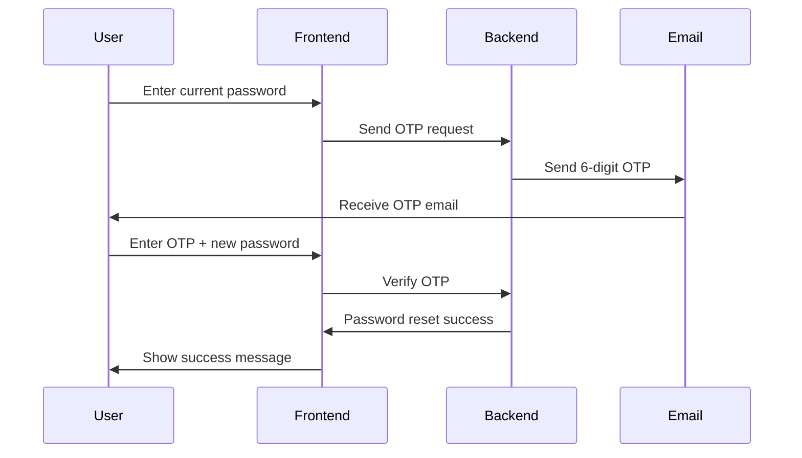

**Steps:**
1. Go to **Settings → Reset Password**
2. Enter current password
3. Click **"Send OTP"**
4. Check email for 6-digit code (expires in 10 min)
5. Enter OTP and new password
6. Click **"Reset Password"**

#### Email Update (OTP Flow)

1. Go to **Settings → Reset Email**
2. Enter new email address
3. Click **"Send OTP"**
4. Check **current email** for 6-digit code
5. Enter OTP
6. Click **"Verify & Update Email"**
7. Auto-logout (login with new email)

#### Account Deletion

1. Go to **Settings → Delete Account**
2. Type **"DELETE"** to confirm
3. Click **"Delete My Account"**
4. All data permanently removed

---

## 📁 Project Structure

```
Subscription-Manager/
│
├── 📂 backend/
│   ├── 📂 controllers/
│   │   ├── authController.js         # Authentication & OTP logic
│   │   └── subscriptionController.js # CRUD operations
│   │
│   ├── 📂 middlewares/
│   │   └── auth.js                   # JWT verification middleware
│   │
│   ├── 📂 models/
│   │   ├── User.js                   # User schema (username, email, password)
│   │   ├── Subscription.js           # Subscription schema
│   │   └── OTP.js                    # OTP schema with TTL index
│   │
│   ├── 📂 routes/
│   │   ├── auth.js                   # Auth routes
│   │   └── subscriptions.js          # Subscription routes
│   │
│   ├── 📂 utils/
│   │   └── emailService.js           # Nodemailer configuration
│   │
│   ├── app.js                        # Express server setup
│   ├── package.json
│   └── .env.example
│
├── 📂 frontend/
│   ├── 📂 src/
│   │   ├── 📂 Components/
│   │   │   ├── Dashboard.jsx         # Main subscription dashboard
│   │   │   ├── FormContainer.jsx     # Add subscription form
│   │   │   ├── Settings.jsx          # Account settings page
│   │   │   ├── Login.jsx            # Login page
│   │   │   ├── Signup.jsx           # Registration page
│   │   │   ├── Homepage.jsx         # Landing page
│   │   │   ├── Navbar.jsx           # Navigation with LiquidEther
│   │   │   ├── OtpInput.jsx         # OTP input component
│   │   │   ├── LiquidEther.jsx      # WebGL background
│   │   │   └── ElectricBorder.jsx   # Animated border SVG
│   │   │
│   │   ├── 📂 redux/
│   │   │   ├── store.js             # Redux store configuration
│   │   │   ├── authSlice.js         # Auth state management
│   │   │   └── subsSlice.js         # Subscription state
│   │   │
│   │   ├── 📂 config/
│   │   │   └── apiConfig.js         # API endpoint configuration
│   │   │
│   │   ├── App.jsx                  # Main app component
│   │   ├── main.jsx                 # Entry point
│   │   └── routes.jsx               # Route definitions
│   │
│   ├── 📂 public/
│   ├── package.json
│   ├── vite.config.js
│   ├── tailwind.config.js
│   ├── postcss.config.js
│   └── index.html
│
├── 📂 screenshots/                   # Application screenshots
│   ├── landing-page.png
│   ├── dashboard.png
│   ├── login.png
│   ├── signup.png
│   ├── add-subscription.png
│   ├── settings.png
│   ├── password-reset.png
│   ├── email-change.png
│   └── account-deletion.png
│
├── 📄 README.md                      # This file
├── 📄 SECURITY_FIX.md               # Security documentation
├── 📄 IMPLEMENTATION_SUMMARY.md     # Feature implementation details
├── 📄 OTP_FLOW.md                   # OTP flow documentation
└── 📄 LICENSE                        # MIT License
```

---

## 🔌 API Documentation

### Authentication Endpoints

| Method | Endpoint | Description | Auth Required |
|--------|----------|-------------|---------------|
| POST | `/api/auth/register` | Register new user | ❌ |
| POST | `/api/auth/login` | Login user | ❌ |
| POST | `/api/auth/logout` | Logout user | ✅ |
| GET | `/api/auth/check` | Check auth status | ✅ |
| DELETE | `/api/auth/delete-account` | Delete user account | ✅ |

### OTP Endpoints

| Method | Endpoint | Description | Auth Required |
|--------|----------|-------------|---------------|
| POST | `/api/auth/send-password-reset-otp` | Send OTP for password reset | ✅ |
| POST | `/api/auth/verify-password-reset-otp` | Verify OTP & reset password | ✅ |
| POST | `/api/auth/send-email-update-otp` | Send OTP for email update | ✅ |
| POST | `/api/auth/verify-email-update-otp` | Verify OTP & update email | ✅ |

### Subscription Endpoints

| Method | Endpoint | Description | Auth Required |
|--------|----------|-------------|---------------|
| GET | `/api/subscriptions` | Get all user subscriptions | ✅ |
| POST | `/api/subscriptions` | Create new subscription | ✅ |
| PUT | `/api/subscriptions/:id` | Update subscription | ✅ |
| DELETE | `/api/subscriptions/:id` | Delete subscription | ✅ |

<details>
<summary><b>📝 Example API Requests</b></summary>

#### Register User
```bash
POST /api/auth/register
Content-Type: application/json

{
  "username": "johndoe",
  "email": "john@example.com",
  "password": "securepass123"
}
```

#### Create Subscription
```bash
POST /api/subscriptions
Content-Type: application/json
Cookie: token=<jwt_token>

{
  "name": "Netflix",
  "category": "Entertainment",
  "price": 15.99,
  "billingCycle": "Monthly",
  "startDate": "2025-01-01",
  "notes": "Family plan"
}
```

</details>

---

## 🔒 Security

### 🛡️ Implemented Security Measures

<table>
<tr>
<td width="50%">

#### Authentication & Authorization
- ✅ JWT stored in HTTP-only cookies
- ✅ 7-day token expiration
- ✅ Secure & SameSite cookie flags
- ✅ Protected routes with middleware
- ✅ User-specific data isolation

</td>
<td width="50%">

#### Password & Data Security
- ✅ bcrypt hashing (10 salt rounds)
- ✅ Minimum password length enforcement
- ✅ OTP email verification (10-min expiry)
- ✅ Rate limiting ready
- ✅ Input validation & sanitization

</td>
</tr>
</table>

### 🔐 OTP Security Features

- **6-digit random codes** - Cryptographically secure generation
- **10-minute expiration** - MongoDB TTL index auto-deletion
- **One active OTP per type** - Previous OTPs invalidated
- **Email delivery** - Sent to verified email only
- **HTML templates** - Professional branded emails

### ⚠️ Security Best Practices

- 🔴 **Never commit `.env` files** to version control
- 🔴 **Use strong JWT secrets** (32+ characters)
- 🔴 **Enable HTTPS** in production
- 🔴 **Regular dependency updates** (`npm audit`)
- 🔴 **Implement rate limiting** for production
- 🔴 **Use environment variables** for all secrets
- 🔴 **Enable MongoDB authentication** in production

---

## 🎯 Roadmap

### 🚧 In Development

- [ ] **Email Notifications** - Renewal reminders before billing date
- [ ] **Analytics Dashboard** - Spending trends, category breakdown
- [ ] **Export Data** - CSV/PDF export functionality
- [ ] **Recurring Reminders** - Customizable notification schedule

### 💡 Future Features

- [ ] **Multi-Currency Support** - USD, EUR, GBP, INR, etc.
- [ ] **Shared Subscriptions** - Family account management
- [ ] **Mobile App** - React Native iOS/Android app
- [ ] **Browser Extension** - Quick-add subscriptions from websites
- [ ] **Payment Integration** - Auto-track via bank API
- [ ] **AI Recommendations** - Suggest subscription optimizations
- [ ] **Social Features** - Share subscription lists with friends

### 🏆 Completed

- [x] User authentication with JWT
- [x] OTP verification system
- [x] CRUD operations for subscriptions
- [x] Responsive UI with Tailwind
- [x] LiquidEther WebGL background
- [x] Password reset functionality
- [x] Email update with verification
- [x] Account deletion

---

## 🤝 Contributing

Contributions make the open-source community an amazing place! Any contributions you make are **greatly appreciated**.

### How to Contribute

1. **Fork** the repository
2. **Clone** your fork
   ```bash
   git clone https://github.com/YOUR_USERNAME/Subscription-Manager.git
   ```
3. **Create** a feature branch
   ```bash
   git checkout -b feature/AmazingFeature
   ```
4. **Make** your changes
5. **Commit** with descriptive message
   ```bash
   git commit -m 'Add some AmazingFeature'
   ```
6. **Push** to your branch
   ```bash
   git push origin feature/AmazingFeature
   ```
7. **Open** a Pull Request

### Development Guidelines

- ✅ Follow existing code style
- ✅ Write meaningful commit messages
- ✅ Add comments for complex logic
- ✅ Test your changes thoroughly
- ✅ Update documentation if needed
- ✅ Ensure no console errors

### Bug Reports

Found a bug? Please open an issue with:
- 🐛 Bug description
- 📋 Steps to reproduce
- 💻 Expected vs actual behavior
- 🖼️ Screenshots (if applicable)
- 🌐 Browser/environment details

---

## 📄 License

This project is licensed under the **MIT License**.

```
MIT License

Copyright (c) 2025 Kathiravan Gopi

Permission is hereby granted, free of charge, to any person obtaining a copy
of this software and associated documentation files (the "Software"), to deal
in the Software without restriction, including without limitation the rights
to use, copy, modify, merge, publish, distribute, sublicense, and/or sell
copies of the Software, and to permit persons to whom the Software is
furnished to do so, subject to the following conditions:

The above copyright notice and this permission notice shall be included in all
copies or substantial portions of the Software.

THE SOFTWARE IS PROVIDED "AS IS", WITHOUT WARRANTY OF ANY KIND, EXPRESS OR
IMPLIED, INCLUDING BUT NOT LIMITED TO THE WARRANTIES OF MERCHANTABILITY,
FITNESS FOR A PARTICULAR PURPOSE AND NONINFRINGEMENT.
```

See [LICENSE](LICENSE) file for full details.

---

## 🙏 Acknowledgments

Special thanks to these amazing projects and resources:

<table>
<tr>
<td align="center" width="20%">
<a href="https://react.dev/">

</a>
<br/>UI Framework
</td>
<td align="center" width="20%">
<a href="https://tailwindcss.com/">

</a>
<br/>CSS Framework
</td>
<td align="center" width="20%">
<a href="https://threejs.org/">

</a>
<br/>WebGL Graphics
</td>
<td align="center" width="20%">
<a href="https://greensock.com/">

</a>
<br/>Animation
</td>
<td align="center" width="20%">
<a href="https://www.mongodb.com/">

</a>
<br/>Database
</td>
</tr>
</table>

- [Express.js](https://expressjs.com/) - Backend framework
- [Redux Toolkit](https://redux-toolkit.js.org/) - State management
- [React Router](https://reactrouter.com/) - Client-side routing
- [Vite](https://vitejs.dev/) - Build tool
- [Nodemailer](https://nodemailer.com/) - Email service

---

## 👨‍💻 Author

<div align="center">

### Kathiravan Gopi

[](https://github.com/KathiravanGopi)
[](mailto:kathiravangopi23@gmail.com)

**Full Stack Developer | MERN Specialist | UI/UX Enthusiast**

</div>

---

## 📞 Support

### Need Help?

- 📖 **Documentation**: Check this README and other docs
- 🐛 **Issues**: [Report bugs](https://github.com/KathiravanGopi/Subscription-Manager/issues)
- 💬 **Discussions**: [GitHub Discussions](https://github.com/KathiravanGopi/Subscription-Manager/discussions)
- 📧 **Email**: kathiravangopi23@gmail.com

### Show Your Support

If this project helped you, please consider:

- ⭐ **Star** this repository
- 🐛 **Report** bugs and issues
- 💡 **Suggest** new features
- 🤝 **Contribute** code improvements
- 📢 **Share** with others

---

## 📊 Project Stats

<div align="center">


</div>

---

<div align="center">

### 🌟 Built with passion using modern web technologies 🌟

**Made with ❤️ by [Kathiravan Gopi](https://github.com/KathiravanGopi)**

---

*Last Updated: October 2025*

</div>
